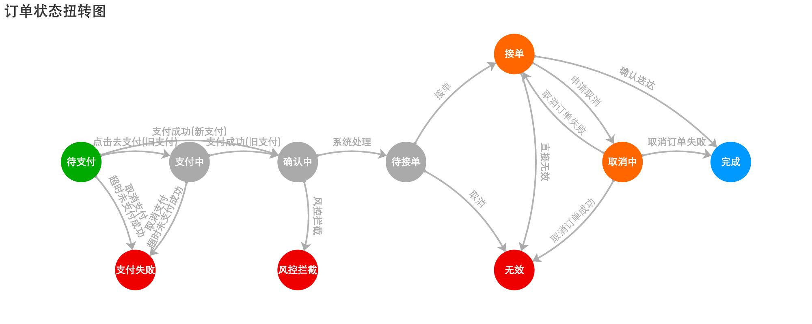
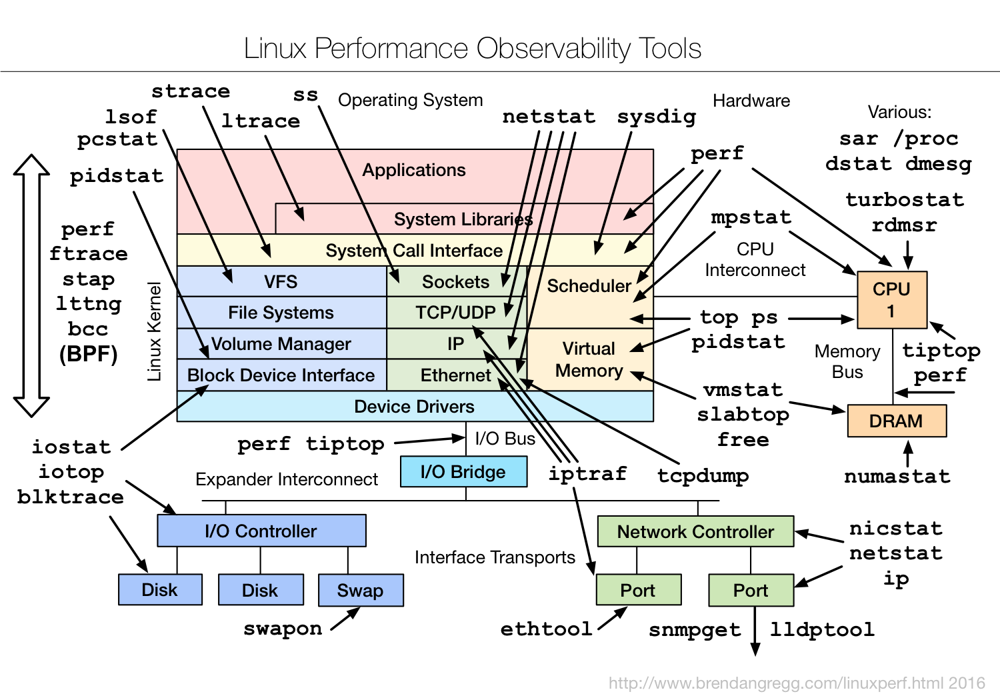

## 基本知识

### 性能测试

`性能测试`，是通过自动化的测试工具模拟多种正常、峰值以及异常负载条件来对系统的各项性能指标进行测试。区别于`压力测试`,在于压力测试要求进行超过规定性能指标的测试。

性能测试的目标为公司交易的主链路，包括`外卖平台`,`商户平台`,`开放平台`,`大物流`,`EOS订单业务`,`新支付`,`ERS餐厅业务`等。

### 测试基本过程

框架测试团队创建测试用户，测试餐厅，使用测试框架(jmeter)脚本模拟`用户下单`，`餐厅接单`，并且对中间`支付`，`物流`环节mock。从而对下单到配送的全链路进行性能测试。

性能测试和生产流程的差异如下:

- 支付mock: 在调用支付的接口时，调用方使用特殊的merchant_id=101。测试团队mock支付调用的第三方服务，返回支付成功或者失败的结果。请求流程为 soa => payment => mock service(mock第三方支付服务)
- 物流特殊处理: 

测试接口的调用，调用比率均通过分析对应服务集群的日志来确定。

### 测试团队相关知识

[业务部门性能测试](http://wiki.ele.to:8090/pages/viewpage.action?pageId=20324754)

## 测试准备

测试前，noc会进行以下操作: 开店

首页banner，皮肤，自动关店，hermes，base.hermes降级，支付mock开关打开

## 监控

测试过程中需要对业务相关指标进行监控，PTS主要包括以下业务

### zeus.eos

需要注意以下指标:

- [eos关键调用指标](https://t.elenet.me/dashboard/dashboard/db/eos-guan-jian-diao-yong-zhi-biao), 主要用于监控主流程相关接口指标
- [eos相关关键指标](https://t.elenet.me/dashboard/dashboard/db/eos-xiang-guan-guan-jian-zhong-yao-zhi-biao)，主要用于监控cache，async task,txdaemon执行情况
- [eos接口总体指标](https://t.elenet.me/dashboard/dashboard/db/eos-jie-kou-zong-ti-zhi-biao)，主要用于对接口总体情况有一个大致的了解

监控需要结合eos主流程来分析问题，EOS主流程如下:

EOS各状态码和对应含义如下:

订单状态|含义
----|----
-5|订单未支付
-3|订单支付中(旧支付)
-4|订单支付失败
-2|订单支付成功
-6|风控无效
0|订单待接单
2|商家接单

EOS主流程和相关接口对应关系如下:

订单状态转变|接口
----|----
None=>-5|create_order
-5=>-3|process_post_pay_for_order
-5=>-4|not_paid_order_auto_fail
-3=>-2/-5=>-2|process_post_pay_success, process_post_pay_success_with_total
-3=>-4|process_post_pay_fail
-2=>0|signal_pending_make_order, signal_post_make_order
0=>2|napos_process_order

### osc.bacchus

订单催单/取消订单服务，对应监控面板: [osc.bacchus](https://t.elenet.me/dashboard/dashboard/db/osc-bacchus)

主要关注自动取消订单(`hitcount(stats.apps.osc.bacchus.real_cancel_order, '60s')`) 和 自动关店(`hitcount(stats.apps.osc.bacchus.real_close_restaurant, '60s')`) 的指标

### osc.chronos

准时达服务，对应监控面板: [osc.chronos](https://t.elenet.me/dashboard/dashboard/db/osc-chronos-zhun-shi-da-jian-kong-kan-ban)

### osc.blink

物流对接服务，对应监控面板: [osc.blink](https://t.elenet.me/dashboard/dashboard/db/blink)

## 问题分析

### 业务问题分析

前提在于**要对订单主流程熟悉**。由于订单连接了`外卖平台`,`商户平台`,`大物流`,`支付`，所以当主流程(包括EOS和其他方)出现问题时，一般会反映在[订单实际状态扭转](https://t.elenet.me/dashboard/dashboard/db/eos-guan-jian-diao-yong-zhi-biao?from=now-30m&to=now&panelId=43&fullscreen)上，可以据此并结合EOS自身的关键流程接口相关指标确认出问题的业务方。

### 技术问题分析

可以借助用来分析的工具包括[grafana](https://t.elenet.me/dashboard/),[etrace](http://etrace.elenet.me/),[elk](http://elk.elenet.me/)，特殊情况也可以直接登陆服务器通过log,分析工具htop,perf,tcpdump等进行分析

进行性能分析前，需要了解EOS的架构: [eos架构](http://wiki.ele.to:8090/pages/viewpage.action?pageId=26612648)

基础服务指标监控如下:

- corvus & redis

redis监控地址: [system-monitor-redis-cluster](https://t.elenet.me/dashboard/dashboard/db/system-monitor-redis-cluster)，需要关注的指标包括`input`,`ops`,`slow commands`,`hit`,`miss`等

eos使用的redis包括:

	- zeus_eos_redis_cache:
		- 端口: 8604 
		- 作用: db_cache, patch_cache
	- eos_zeus_redis_cache:
		- 端口: 8125 
		- 作用: api_cache
	- eos_zeus_other_redis_cache:
		- 端口: 8147 
		- 作用: lock_param, rst_number_cache

由于redis的网络流程为: `client => goproxy => corvus`，redis的性能排查应该是从上往下逐级进行, corvus对应的监控地址为: [esm.corvus.cluster](https://t.elenet.me/dashboard/dashboard/db/esm-corvus-cluster?var-cluster=eos_zeus_other_redis_cache&var-machine=xg-zeus-eos-redis-1&from=now-30m&to=now)

- rmq

rabbitmq监控地址: [system-monitor-rabbitmq-queue](https://t.elenet.me/dashboard/dashboard/db/system-monitor-rabbitmq-queue)，需要关注的指标包括ready, publish, ack情况等

- dal & db

dal和db的监控可以使用etrace，对应地址如下: [etrace dal](http://etrace.elenet.me/main2.html#/dal/sql) eos对应的group包括:
	
	- eos_mobile_eleme-zeus_eos_group
	- eos_items_eleme-zeus_eos_group
	- eos_eleme-zeus_eos_group
	- eos_record_eleme-zeus_eos_group

同时DAL会关注dal相关指标:

[dal性能指标](https://t.elenet.me/dashboard/dashboard/db/dalxing-neng-zhi-biao-xg?var-group=eos_eleme-zeus_eos_group&var-group=login_eleme-biz_member_group)

grafana切换到dal，对应的[dal-proxy服务器性能指标](https://t.elenet.me/dashboard/dashboard/db/system-monitor)

DBA会关注对应的DB服务器性能指标，慢SQL，lock等

- 应用服务器

应用服务器的监控在: [system.monitor.all](https://t.elenet.me/dashboard/dashboard/db/system-monitor-all)，主要关注服务器的`CPU Util`,`Memory`,`Network`和`IO`等

EOS对应的集群分布为:

	- 外卖平台: sync-01, sync-02
	- 新支付: sync-01
	- 商户端: sync-03
	- misc: sync-04
	- 异步task: async
	- script,txdaemon: cron

更详细的TCP监控在[system.monitor.net.tcp](https://t.elenet.me/dashboard/dashboard/db/system-monitor-net-tcp?var-machine=qcr-zeus-eos-async-19&var-machine=qcr-zeus-eos-async-20&var-machine=qcr-zeus-eos-sync1-11&var-machine=xg-dtcase-master-01&from=now-12h&to=now)，可以在这里看tcp的连接情况

#### 性能分析的推荐步骤

性能分析的一般步骤为根据调用链路逐级住下，流程为: 接口 => 中间件 => 基础服务 => 操作系统

- 接口性能分析时需要关注代码逻辑和接口依赖，接口依赖包括其他SOA服务依赖，基础服务依赖等，可以通过etrace观察调用链路分析瓶颈点
- 中间件 和 基础服务 的性能主要通过对应的指标监控，观察对应的`cpu`,`memory`,`Network`,`IO`,`TCP`等
- 操作系统级别的性能分析可以参考[Linux Performance](http://www.brendangregg.com/linuxperf.html)

